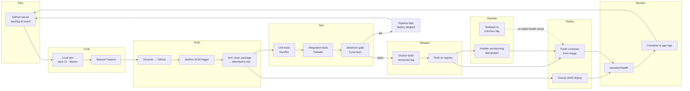
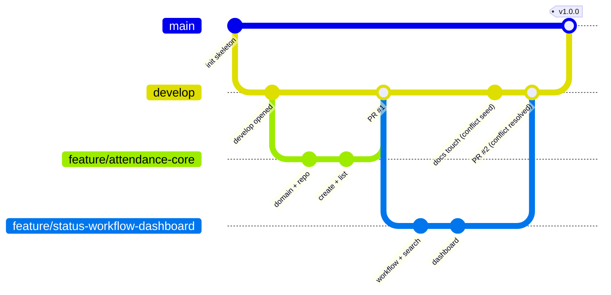

# Stage 2 — Agile Planning and DevOps Workflow

**Project:** Student Attendance Management Portal
**Method:** Scrum with a Kanban work-in-progress limit (Scrumban)
**Cadence:** 3 sprints × 5 tasks = the frozen 15-task plan from Stage 1

---

## 1. Product Backlog

Estimates use story points on a modified Fibonacci scale
(1, 2, 3, 5, 8, 13). Priority is MoSCoW
(**M**ust / **S**hould / **C**ould / **W**on't).

### 1.1 Epics

| Epic | Title | Business outcome |
|---|---|---|
| E-1 | Attendance system of record | Replace the paper register with one authoritative store |
| E-2 | Review and accountability | No mark becomes official without review and attribution |
| E-3 | Insight and self-service | Students and HODs get answers without asking a clerk |
| E-4 | Continuous delivery pipeline | Every commit is built, tested and deployable |
| E-5 | Operability and reliability | The service can be provisioned, observed and rolled back |

### 1.2 Backlog items

| ID | Epic | User story | Pts | Pri | Sprint | Status |
|---|---|---|---|---|---|---|
| US-01 | E-1 | Faculty records attendance for a class session | 8 | M | 1 | Done |
| US-02 | E-1 | Faculty/HOD/Admin views a paginated list of records | 5 | M | 1 | Done |
| US-03 | E-1 | Faculty corrects an editable record | 5 | M | 2 | Done |
| US-04 | E-3 | User searches and filters records | 5 | M | 2 | Done |
| US-05 | E-2 | Faculty submits a draft for review | 3 | M | 2 | Done |
| US-06 | E-2 | HOD approves or rejects a submitted record | 8 | M | 2 | Done |
| US-07 | E-2 | Every state change records actor and timestamp | 3 | M | 2 | Done |
| US-08 | E-3 | Summary dashboard of attendance and workflow state | 8 | M | 2 | Done |
| US-09 | E-3 | Student sees only their own approved attendance | 5 | M | 2 | Done |
| US-10 | E-1 | Sign in and be authorised by role | 5 | M | 1 | Done |
| US-11 | E-4 | Repository with branch policy and templates | 3 | M | 1 | Done |
| US-12 | E-4 | Jenkins builds and archives on every change | 8 | M | 2 | Done |
| US-13 | E-4 | Pipeline defined as code in the repository | 8 | M | 2 | Done |
| US-14 | E-4 | Selenium suite covers the critical journeys | 13 | M | 3 | Done |
| US-15 | E-4 | Failing tests stop the deployment | 5 | M | 3 | Done |
| US-16 | E-5 | Application ships as a versioned container image | 8 | M | 3 | Done |
| US-17 | E-5 | Image is published and a fresh container deployed automatically | 8 | M | 3 | Done |
| US-18 | E-5 | Target node is provisioned declaratively and idempotently | 8 | M | 3 | Done |
| US-19 | E-5 | Health check and rollback to the previous stable release | 8 | M | 3 | Done |
| US-20 | E-3 | At-risk list highlights students below the eligibility threshold | 3 | S | 3 | Done |
| US-21 | E-1 | Bulk import of attendance from a spreadsheet | 8 | W | — | Deferred (Stage 15) |
| US-22 | E-3 | SMS/e-mail shortage notification | 5 | W | — | Deferred (Stage 15) |
| US-23 | E-1 | Biometric device capture | 13 | W | — | Deferred (Stage 15) |
| US-24 | E-5 | Kubernetes deployment | 13 | W | — | Deferred (Stage 15) |

**Committed total:** 128 points across 20 delivered stories.
**Deferred:** 39 points recorded in the Stage 15 future-enhancement plan.

---

## 2. User Stories with Acceptance Criteria

Acceptance criteria are written in Given/When/Then so that each one maps
directly to an automated test. The **Verified by** column names the test
or artefact that proves it.

### US-01 — Record attendance for a class session

> **As a** faculty member
> **I want to** record each student's attendance for a subject, date and period
> **so that** the register exists in one authoritative place from the moment the class ends.

| # | Acceptance criterion | Verified by |
|---|---|---|
| AC-1 | **Given** I am signed in as faculty **when** I open the new-record form **then** I can choose a student, subject code, session date, period and attendance status | `AttendanceWebFlowIT` |
| AC-2 | **Given** I submit a valid record **when** it is saved **then** its workflow status is `DRAFT` and it appears in the list | `AttendanceServiceTest#createStartsInDraft` |
| AC-3 | **Given** a record already exists for the same student, subject, date and period **when** I submit a duplicate **then** it is rejected with a readable message | `AttendanceServiceTest#rejectsDuplicate` |
| AC-4 | **Given** a session date in the future **when** I submit **then** validation fails | `AttendanceValidationTest#futureDateRejected` |
| AC-5 | **Given** the record is saved **then** `markedBy` holds my username and `createdAt` holds the save time | `AttendanceServiceTest#recordsActorAndTimestamp` |
| AC-6 | Recording a full class session takes under two minutes | Selenium journey **J1** |

### US-02 — View a paginated list of records

> **As a** faculty member, HOD or administrator
> **I want to** see attendance records in a paginated, sorted list
> **so that** I can locate and check entries without reading a register.

| # | Acceptance criterion | Verified by |
|---|---|---|
| AC-1 | The list shows roll number, name, subject, date, period, attendance status and workflow status | `AttendanceWebFlowIT` |
| AC-2 | Results are paginated at 10 rows per page with working page links | Selenium journey **J2** |
| AC-3 | Default ordering is most recent session date first | `AttendanceRepositoryTest#defaultSortIsRecentFirst` |
| AC-4 | A student signed in sees only their own records | `AttendanceSecurityTest#studentSeesOnlyOwnRecords` |

### US-03 — Correct an editable record

> **As a** faculty member
> **I want to** correct a record I entered
> **so that** a genuine mistake does not become an official mark.

| # | Acceptance criterion | Verified by |
|---|---|---|
| AC-1 | A record in `DRAFT` or `REJECTED` is editable by its author | `AttendanceServiceTest#draftAndRejectedAreEditable` |
| AC-2 | A record in `SUBMITTED` or `APPROVED` is not editable | `AttendanceServiceTest#submittedAndApprovedAreLocked` |
| AC-3 | Saving an edit updates `updatedAt` and keeps the original `markedBy` | `AttendanceServiceTest#updatePreservesAuthor` |
| AC-4 | A faculty member cannot edit another faculty member's record | `AttendanceSecurityTest#cannotEditOthersRecord` |

### US-04 — Search and filter

> **As a** faculty member, HOD or administrator
> **I want to** filter records by roll number, subject, date range and status
> **so that** I can answer a question about one student in seconds.

| # | Acceptance criterion | Verified by |
|---|---|---|
| AC-1 | Filtering by roll number returns only that student's records | `AttendanceSearchTest#filterByRollNumber` |
| AC-2 | Filtering by subject code returns only that subject | `AttendanceSearchTest#filterBySubject` |
| AC-3 | A date range is inclusive of both endpoints | `AttendanceSearchTest#dateRangeInclusive` |
| AC-4 | Filters combine with AND semantics | `AttendanceSearchTest#filtersCombine` |
| AC-5 | A search with no matches shows an explicit empty-state message | Selenium journey **J2** |
| AC-6 | Filters survive pagination | Selenium journey **J2** |

### US-05 — Submit a draft for review

> **As a** faculty member
> **I want to** submit my draft attendance for the HOD's review
> **so that** it enters the official approval path.

| # | Acceptance criterion | Verified by |
|---|---|---|
| AC-1 | `DRAFT → SUBMITTED` is permitted for the record's author | `WorkflowServiceTest#facultyMaySubmitOwnDraft` |
| AC-2 | A submitted record becomes read-only for the author | `AttendanceServiceTest#submittedAndApprovedAreLocked` |
| AC-3 | `SUBMITTED → SUBMITTED` is refused | `WorkflowServiceTest#illegalTransitionsRefused` |
| AC-4 | A student may not submit anything | `WorkflowServiceTest#studentMayNotTransition` |

### US-06 — Approve or reject a submitted record

> **As a** Head of Department
> **I want to** approve or reject submitted attendance, giving a reason when I reject
> **so that** no mark becomes official without review.

| # | Acceptance criterion | Verified by |
|---|---|---|
| AC-1 | A HOD sees a queue of `SUBMITTED` records | Selenium journey **J3** |
| AC-2 | `SUBMITTED → APPROVED` stores `reviewedBy` and `reviewedAt` | `WorkflowServiceTest#approvalRecordsReviewer` |
| AC-3 | `SUBMITTED → REJECTED` requires a non-blank reason | `WorkflowServiceTest#rejectionRequiresReason` |
| AC-4 | A rejected record becomes editable again by its author | `WorkflowServiceTest#rejectedBecomesEditable` |
| AC-5 | A faculty member cannot approve a record | `WorkflowServiceTest#facultyMayNotApprove` |
| AC-6 | Approving a record makes it visible to the student | Selenium journey **J4** |

### US-07 — Attribution on every state change

> **As an** auditor
> **I want** every create, update and status transition attributed to a named user with a timestamp
> **so that** the record is defensible in a university audit.

| # | Acceptance criterion | Verified by |
|---|---|---|
| AC-1 | Create stores `markedBy` + `createdAt` | `AttendanceServiceTest#recordsActorAndTimestamp` |
| AC-2 | Update stores `updatedAt` | `AttendanceServiceTest#updatePreservesAuthor` |
| AC-3 | Approve/reject stores `reviewedBy`, `reviewedAt` and the review comment | `WorkflowServiceTest#approvalRecordsReviewer` |
| AC-4 | No code path can change workflow status without passing through the workflow service | Architecture review, Stage 3 §6 |

### US-08 — Summary dashboard

> **As a** HOD
> **I want** a dashboard of totals, percentages and per-subject figures
> **so that** I do not need a clerk to consolidate a spreadsheet.

| # | Acceptance criterion | Verified by |
|---|---|---|
| AC-1 | Cards show counts for `DRAFT`, `SUBMITTED`, `APPROVED`, `REJECTED` | `DashboardServiceTest#countsByWorkflowStatus` |
| AC-2 | Overall attendance percentage counts only `APPROVED` records | `DashboardServiceTest#percentageUsesApprovedOnly` |
| AC-3 | A per-subject breakdown lists sessions held, present and percentage | `DashboardServiceTest#perSubjectBreakdown` |
| AC-4 | The at-risk list names students below the eligibility threshold | `DashboardServiceTest#atRiskBelowThreshold` |
| AC-5 | The dashboard loads with no records present and shows zeroes, not an error | `DashboardServiceTest#emptyStateIsZero` |

### US-09 — Student self-service

> **As a** student
> **I want to** see my own approved attendance percentage
> **so that** I know my eligibility status while I can still act on it.

| # | Acceptance criterion | Verified by |
|---|---|---|
| AC-1 | A student sees their own records only | `AttendanceSecurityTest#studentSeesOnlyOwnRecords` |
| AC-2 | A student sees only `APPROVED` records | `AttendanceSecurityTest#studentSeesOnlyApproved` |
| AC-3 | A student cannot reach create, edit or review actions | Selenium journey **J5** |
| AC-4 | Their percentage and at-risk flag are shown per subject | Selenium journey **J4** |

### US-10 — Authentication and role-based authorisation

> **As the** institution
> **I want** each user authenticated and restricted to their role's actions
> **so that** the register cannot be altered by whoever happens to hold it.

| # | Acceptance criterion | Verified by |
|---|---|---|
| AC-1 | An unauthenticated request to a protected page redirects to the login page | `AttendanceSecurityTest#anonymousRedirectedToLogin` |
| AC-2 | Invalid credentials produce an error and no session | Selenium journey **J5** |
| AC-3 | Roles `FACULTY`, `HOD`, `ADMIN`, `STUDENT` are enforced per action | `AttendanceSecurityTest` |
| AC-4 | A refused action returns 403 and changes no data | `WorkflowServiceTest#studentMayNotTransition` |
| AC-5 | `/actuator/health` is reachable without authentication | `HealthEndpointTest#healthIsPublic` |

### Engineering stories US-11 … US-19

| ID | Story | Acceptance criterion | Verified by |
|---|---|---|---|
| US-11 | Repository with policy and templates | README, `.gitignore`, issue + PR templates, documented branch naming, meaningful commits | Stage 4 deliverable |
| US-12 | Jenkins builds on change | A job polls SCM, builds with Maven, archives the WAR, and fails on a broken build | Stage 7 proofs |
| US-13 | Pipeline as code | `Jenkinsfile` with checkout, build, package and deploy stages and one parameterised environment setting | Stage 8 proofs |
| US-14 | Selenium journeys | 5 journeys with assertions, fixed test data and a screenshot captured on failure | Stage 9 proofs |
| US-15 | Quality gate | A failing Selenium test leaves the pipeline red and the deploy stage unexecuted | Stage 10 proofs |
| US-16 | Container image | Dockerfile builds a tagged image; lifecycle commands documented with real output | Stage 11 proofs |
| US-17 | Registry and auto-deploy | Pipeline pushes a version-tagged image and replaces the running container after tests pass | Stage 12 proofs |
| US-18 | Declarative provisioning | Playbook configures packages, user, directories, files, port and service; second run reports `changed=0` | Stage 13–14 proofs |
| US-19 | Health check and rollback | Playbook probes health after deploy and can restore the previous image tag | Stage 14 proofs |

---

## 3. Definition of Ready

A backlog item may enter a sprint only when:

1. It is written as a user story with a clear beneficiary and outcome.
2. It has testable Given/When/Then acceptance criteria.
3. It is estimated and prioritised.
4. Its dependencies are identified and either resolved or sequenced earlier.
5. Any UI change has an agreed stable test hook (`data-testid`).
6. It is small enough to finish inside one sprint.

## 4. Definition of Done

An item is Done only when **all** of the following hold. This is the gate
applied at the end of every one of the 15 tasks.

| # | Criterion | How it is checked |
|---|---|---|
| D1 | Code is implemented and reviewed on a pull request | GitHub PR with at least one review comment addressed |
| D2 | Every acceptance criterion has a passing automated test | Surefire/Failsafe reports |
| D3 | Unit + integration suite is green locally | `mvn clean verify` |
| D4 | Coverage of domain + service packages is ≥ 70% | JaCoCo report |
| D5 | The Jenkins pipeline is green on the merge commit | Jenkins build log |
| D6 | The Selenium quality gate passed | Failsafe report published by Jenkins |
| D7 | No new high-severity static-analysis finding | SpotBugs report |
| D8 | Documentation for the stage is written and committed | `docs/stage-NN-*.md` |
| D9 | Evidence is captured in `proofs/stage-NN/` | Command logs, screenshots, reports |
| D10 | The artefact is deployable and the deployed instance answers its health check | Pipeline deploy stage + `/actuator/health` |
| D11 | The branch is merged and the feature branch deleted | GitHub branch list |
| D12 | The backlog item's status is updated | This document |

**Not Done** if any of: tests skipped to force green, a stage documented
but not executed, evidence described but not captured, or a manual step
required that the pipeline was supposed to automate.

---

## 5. Sprint Plan

Three sprints, five tasks each, matching the frozen 15-task plan.

### Sprint 1 — Foundation and first vertical slice (Tasks 1–5)

| Field | Value |
|---|---|
| Sprint goal | A faculty member can sign in and record attendance that is stored and listed, on a repository with a working branch-and-PR discipline. |
| Tasks | 1 Problem definition · 2 Agile planning · 3 Architecture and setup · 4 Repository initialisation · 5 Feature 1 with branching |
| Stories | US-01, US-02, US-10, US-11 |
| Points | 21 |
| Demo | Sign in as faculty, create a record, see it in the list; show the merged pull request. |
| Risks | Stack choice must support both Tomcat deployment and Selenium — mitigated by choosing server-rendered Thymeleaf with WAR packaging. |

### Sprint 2 — MVP completion and continuous integration (Tasks 6–10)

| Field | Value |
|---|---|
| Sprint goal | The full MVP works end to end and every commit is built, tested and gated by Jenkins. |
| Tasks | 6 MVP + conflict + tag · 7 Jenkins CI job · 8 Pipeline as code + deploy · 9 Selenium design · 10 Continuous testing |
| Stories | US-03 … US-09, US-12, US-13, US-14, US-15 |
| Points | 73 |
| Demo | Approve a record as HOD, see it appear for the student; push a commit and watch Jenkins build, test and deploy; show a red pipeline from a deliberate defect and the green rerun after the fix. |
| Risks | Browser tests are the usual source of flakiness — mitigated by explicit waits, fixed seeded data and a pinned ChromeDriver. |

### Sprint 3 — Containerisation, provisioning and release (Tasks 11–15)

| Field | Value |
|---|---|
| Sprint goal | The tested application is published as a versioned image, deployed automatically, provisioned declaratively and can be rolled back. |
| Tasks | 11 Docker lifecycle · 12 Jenkins–Docker CD · 13 Ansible playbook · 14 Provisioning + rollback · 15 Release, documentation, viva |
| Stories | US-16 … US-20 |
| Points | 34 |
| Demo | One commit drives build → test → image → registry → container; rerun the playbook to show `changed=0`; roll back to the previous tag and show the health check passing. |
| Risks | Lab machine resource limits — mitigated by a single-node Docker setup, H2 instead of a separate database server, and a local registry. |

### Velocity

| Sprint | Committed | Completed |
|---|---|---|
| 1 | 21 | 21 |
| 2 | 73 | 73 |
| 3 | 34 | 34 |

---

## 6. Kanban / Scrum Task Board

WIP limit: **2** items in `In Progress` at any time (single developer).

Columns: `Backlog` → `Ready` → `In Progress` → `In Review` → `Testing` → `Done`

Final board state at project close:

| Task | Title | Sprint | Column | Evidence |
|---|---|---|---|---|
| T-01 | Problem definition and scope | 1 | Done | `docs/stage-01-problem-definition.md` |
| T-02 | Agile planning and DevOps workflow | 1 | Done | `docs/stage-02-agile-planning.md` |
| T-03 | Requirements, architecture, setup | 1 | Done | `docs/stage-03-requirements-architecture.md` |
| T-04 | Repository initialisation | 1 | Done | `docs/stage-04-repository-initialisation.md` |
| T-05 | Feature 1 with branching | 1 | Done | `docs/stage-05-feature-branching.md` |
| T-06 | MVP completion, conflict, tag | 2 | Done | `docs/stage-06-mvp-collaboration.md` |
| T-07 | Jenkins CI job | 2 | Done | `docs/stage-07-jenkins-ci.md` |
| T-08 | Pipeline as code and deploy | 2 | Done | `docs/stage-08-pipeline-as-code.md` |
| T-09 | Selenium design and local run | 2 | Done | `docs/stage-09-selenium-tests.md` |
| T-10 | Continuous testing in Jenkins | 2 | Done | `docs/stage-10-continuous-testing.md` |
| T-11 | Docker image and lifecycle | 3 | Done | `docs/stage-11-docker-lifecycle.md` |
| T-12 | Jenkins–Docker CD | 3 | Done | `docs/stage-12-jenkins-docker-cd.md` |
| T-13 | Configuration management script | 3 | Done | `docs/stage-13-configuration-management.md` |
| T-14 | Provisioning and reliability | 3 | Done | `docs/stage-14-provisioning-reliability.md` |
| T-15 | Release, documentation, viva | 3 | Done | `docs/stage-15-final-report.md` |

### Board policies

- An item enters `In Progress` only if it satisfies the Definition of Ready.
- `In Progress` → `In Review` requires a pull request.
- `In Review` → `Testing` requires review comments resolved and CI green.
- `Testing` → `Done` requires the full Definition of Done, including captured evidence.
- A blocked item is tagged `blocked`, keeps its column, and its blocker is
  recorded as a GitHub issue.

---

## 7. DevOps Lifecycle — Development to Operations

### 7.1 End-to-end toolchain

### 7.2 Stage-to-phase mapping

| DevOps phase | Tooling | Project stage |
|---|---|---|
| Plan | GitHub Issues, labels, board | 1, 2 |
| Code | Java 21, Maven, Git, branch policy | 3, 4, 5, 6 |
| Build | Jenkins freestyle job + `Jenkinsfile` | 7, 8 |
| Test | JUnit 5, Spring Boot Test, Selenium WebDriver | 9, 10 |
| Release | Docker image, semantic version tags, local registry | 11, 12 |
| Deploy | Tomcat 10.1 WAR, Docker container | 8, 12 |
| Operate | Ansible playbook, idempotent reruns, rollback | 13, 14 |
| Monitor | Spring Boot Actuator health, container logs | 14, 15 |

### 7.3 Branching model

A trunk-plus-develop model, small enough for one developer but with real
gates.

### 7.4 Feedback loops

| Loop | Trigger | Signal | Target time |
|---|---|---|---|
| L1 | Local save | Compile + unit tests | < 1 min |
| L2 | Push to `feature/*` | Jenkins build + unit tests | < 5 min |
| L3 | Pull request | Review comments + CI status | < 1 day |
| L4 | Merge to `develop` | Full pipeline incl. Selenium gate | < 15 min |
| L5 | Deploy | Health check | < 1 min after deploy |
| L6 | Failed health check | Rollback to previous stable tag | < 2 min |

### 7.5 Quality gates

| Gate | Stage in pipeline | Condition to pass | Consequence of failure |
|---|---|---|---|
| G1 Compile | Build | Code compiles | Pipeline fails immediately |
| G2 Unit | Test | All Surefire tests pass | Pipeline fails; no package |
| G3 Coverage | Test | Domain + service ≥ 70% | Build marked unstable |
| G4 Integration | Verify | All Failsafe tests pass | Pipeline fails; no image |
| G5 Selenium | Quality gate | All 5 journeys pass | **Deploy stage skipped** |
| G6 Image | Release | Image builds and is tagged | No registry push |
| G7 Health | Deploy | `/actuator/health` returns `UP` | Rollback to previous tag |

---

## 8. Ceremonies and Artefacts

| Ceremony | Cadence | Output |
|---|---|---|
| Sprint planning | Start of each sprint | Sprint goal + committed tasks (§5) |
| Daily stand-up | Daily (self-review log) | Board update, blockers raised as issues |
| Backlog refinement | Mid-sprint | Re-estimates, split stories |
| Sprint review | End of each sprint | Working demo against acceptance criteria |
| Sprint retrospective | End of each sprint | Improvements recorded below |

### Retrospective outcomes

| Sprint | What worked | What hurt | Action taken |
|---|---|---|---|
| 1 | Vertical slice first proved the whole stack early | Choosing packaging late risked rework | Fixed WAR + context path in Stage 3 before coding |
| 2 | Selenium hooks (`data-testid`) added while writing templates | A real merge conflict cost time to resolve carefully | Documented the conflict and resolution as Stage 6 evidence |
| 3 | Idempotency proved by a genuine second playbook run | Lab network blocks some upstream hosts | Pinned all dependencies to reachable mirrors; recorded in troubleshooting guide |
