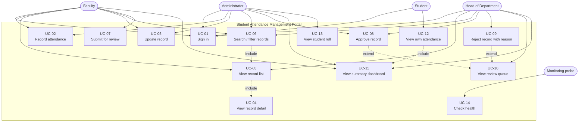
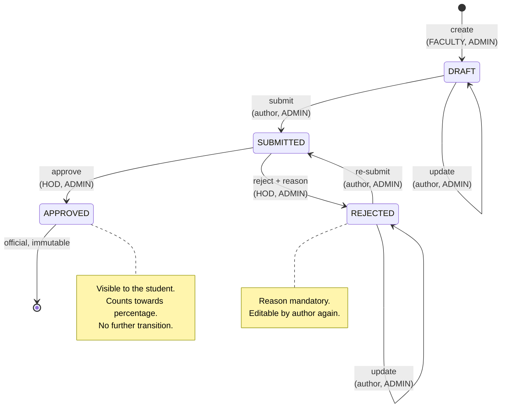
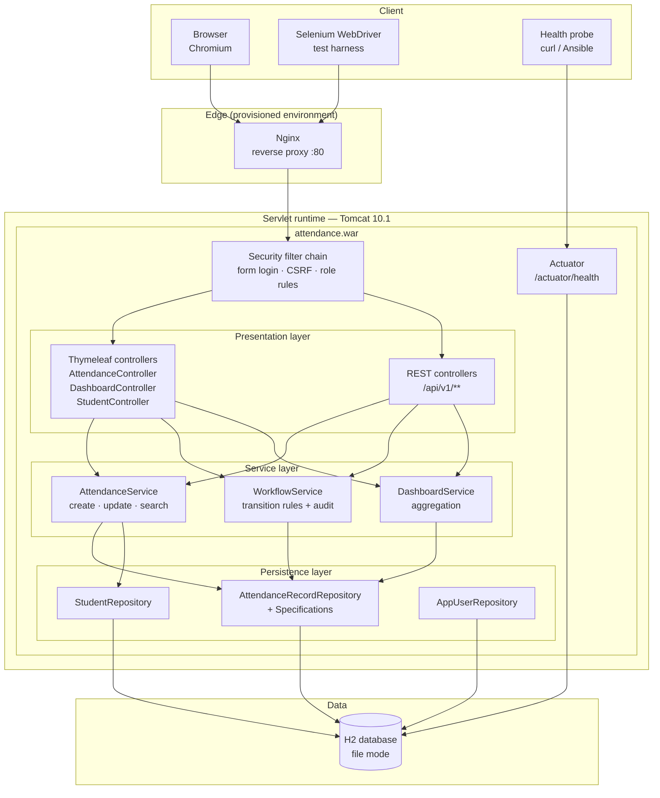
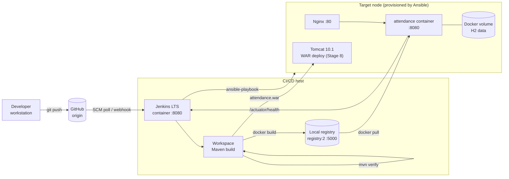
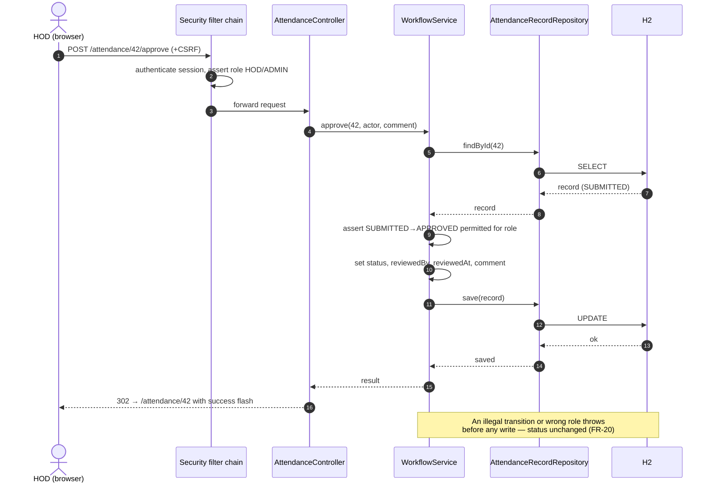
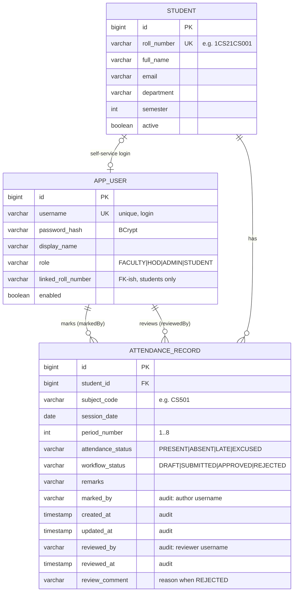

# Stage 3 — Requirements, Architecture and Technology Setup

**Project:** Student Attendance Management Portal
**Scope basis:** MVP frozen in Stage 1 §8

---

## 1. SRS Summary

### 1.1 Purpose

Specify the software requirements for the MVP of the Student Attendance
Management Portal: a role-aware web application that is the single system
of record for classroom attendance, enforcing a review workflow and
providing per-role read paths and a departmental summary.

### 1.2 Product perspective

A self-contained server-rendered web application. It owns its own
relational schema and exposes a browser UI plus a small REST API used by
automated tests and future integrations. It does not integrate with the
university ERP in the MVP.

### 1.3 Actors

| Actor | Authentication | Capabilities |
|---|---|---|
| Faculty | `FACULTY` | Create, view, update own editable records, submit for review, search, dashboard |
| Head of Department | `HOD` | View, search, approve/reject submitted records, dashboard |
| Administrator | `ADMIN` | All faculty and HOD read paths, student roll view, full search, dashboard |
| Student | `STUDENT` | View own approved records and own dashboard only |
| Operator/monitor | none | `GET /actuator/health` |

### 1.4 Functional requirements

| ID | Requirement | Priority | Source story |
|---|---|---|---|
| FR-01 | The system shall authenticate users with username and password and establish a role-bearing session. | Must | US-10 |
| FR-02 | The system shall redirect an unauthenticated request for a protected resource to the login page. | Must | US-10 |
| FR-03 | A faculty or admin user shall create an attendance record capturing student, subject code, session date, period, attendance status and optional remarks. | Must | US-01 |
| FR-04 | A new record shall be created with workflow status `DRAFT`. | Must | US-01 |
| FR-05 | The system shall reject a record that duplicates an existing (student, subject, date, period) tuple. | Must | US-01 |
| FR-06 | The system shall reject a session date in the future. | Must | US-01 |
| FR-07 | The system shall store the creating user and creation timestamp on every record. | Must | US-07 |
| FR-08 | The system shall present records in a paginated list of 10 rows, most recent session first. | Must | US-02 |
| FR-09 | The system shall present a single-record detail view including its full audit fields. | Must | US-02 |
| FR-10 | The system shall allow the author or an admin to update a record whose workflow status is `DRAFT` or `REJECTED`. | Must | US-03 |
| FR-11 | The system shall refuse updates to a record whose workflow status is `SUBMITTED` or `APPROVED`. | Must | US-03 |
| FR-12 | The system shall record the update timestamp and preserve the original author on update. | Must | US-07 |
| FR-13 | The system shall filter records by roll number, subject code, inclusive date range, attendance status and workflow status, combined with AND semantics. | Must | US-04 |
| FR-14 | The system shall preserve active filters across pagination. | Must | US-04 |
| FR-15 | The system shall display an explicit empty-state message when a search matches nothing. | Should | US-04 |
| FR-16 | The system shall permit the transition `DRAFT → SUBMITTED` only to the record's author or an admin. | Must | US-05 |
| FR-17 | The system shall permit `SUBMITTED → APPROVED` and `SUBMITTED → REJECTED` only to a HOD or admin. | Must | US-06 |
| FR-18 | The system shall require a non-blank reason for a rejection. | Must | US-06 |
| FR-19 | The system shall permit `REJECTED → SUBMITTED` (re-submission) by the author or an admin. | Must | US-06 |
| FR-20 | The system shall refuse every transition not in the permitted set and change no data when refusing. | Must | US-05, US-06 |
| FR-21 | The system shall store reviewing user, review timestamp and review comment on approval or rejection. | Must | US-07 |
| FR-22 | The system shall provide a review queue listing `SUBMITTED` records for HOD and admin. | Must | US-06 |
| FR-23 | The system shall compute a summary dashboard: counts per workflow status, overall attendance percentage from `APPROVED` records only, per-subject breakdown, and an at-risk list below the eligibility threshold. | Must | US-08, US-20 |
| FR-24 | The dashboard shall render zero values rather than an error when no records exist. | Must | US-08 |
| FR-25 | A student shall see only their own records, and only those with workflow status `APPROVED`. | Must | US-09 |
| FR-26 | A student shall not be able to reach create, update or review actions. | Must | US-09 |
| FR-27 | The system shall expose an unauthenticated health endpoint reporting application and datastore liveness. | Must | US-10 |
| FR-28 | The system shall expose a REST API mirroring the search, create, read, update, transition and summary operations. | Should | US-12 … US-15 |
| FR-29 | The system shall seed a deterministic set of users, students and attendance records on an empty datastore. | Must | US-14 |

### 1.5 Non-functional requirements

| ID | Category | Requirement | Verification |
|---|---|---|---|
| NFR-01 | Performance | A list or search page shall respond within 1 s for 10,000 records on the lab machine. | Timed integration test |
| NFR-02 | Usability | Recording attendance for one class session shall take under 2 min. | Selenium journey J1 |
| NFR-03 | Security | Passwords shall be stored only as BCrypt hashes. | Code review + unit test |
| NFR-04 | Security | All state-changing requests shall carry a CSRF token. | Spring Security default, integration test |
| NFR-05 | Security | Authorisation shall be enforced server-side on every action, never only in the UI. | `AttendanceSecurityTest` |
| NFR-06 | Auditability | 100% of state changes shall carry actor and timestamp. | `WorkflowServiceTest` |
| NFR-07 | Portability | The artefact shall deploy to Tomcat 10.1 and run standalone from the same WAR. | Stage 8 + Stage 11 proofs |
| NFR-08 | Configurability | Port, context path, datastore URL, eligibility threshold and deploy environment shall be settable by environment variable without a rebuild. | Stage 8 parameterisation proof |
| NFR-09 | Observability | The application shall expose health and info endpoints and log to stdout for container capture. | Stage 14 health-check proof |
| NFR-10 | Testability | Every UI element asserted by a test shall carry a stable `data-testid`. | Template review |
| NFR-11 | Maintainability | Domain and service packages shall reach ≥ 70% line coverage. | JaCoCo |
| NFR-12 | Reliability | Provisioning shall be idempotent: a second run reports zero changes. | Stage 14 `changed=0` |
| NFR-13 | Recoverability | Rollback to the previous stable release shall complete within 2 min. | Stage 14 rollback demo |
| NFR-14 | Compatibility | The UI shall work on current Chromium-based browsers at 1280×800 and above. | Selenium runs at 1280×800 |

### 1.6 Business rules

| ID | Rule |
|---|---|
| BR-01 | A record is uniquely identified by (student, subject code, session date, period). |
| BR-02 | Attendance status is one of `PRESENT`, `ABSENT`, `LATE`, `EXCUSED`. |
| BR-03 | Only `PRESENT` and `LATE` count towards attendance percentage; `EXCUSED` is excluded from both numerator and denominator; `ABSENT` counts in the denominator only. |
| BR-04 | Only `APPROVED` records contribute to any published percentage. |
| BR-05 | The examination-eligibility threshold is 75% and is configurable. |
| BR-06 | A rejection must carry a reason; an approval may carry an optional comment. |
| BR-07 | Workflow status may change only through the workflow service, never by direct repository write. |

---

## 2. Use-Case Model

### 2.1 Use-case diagram



### 2.2 Primary use-case specification — UC-02 Record attendance

| Field | Content |
|---|---|
| **Actor** | Faculty (primary), Administrator |
| **Goal** | Persist an attendance mark for one student, subject, date and period |
| **Precondition** | Actor authenticated with role `FACULTY` or `ADMIN`; the student exists and is active |
| **Trigger** | Actor opens *New attendance record* |
| **Main flow** | 1. Actor opens the form. 2. System lists active students and known subject codes. 3. Actor selects student, subject, session date, period, attendance status; optionally adds remarks. 4. Actor saves. 5. System validates the input. 6. System checks the uniqueness rule BR-01. 7. System persists the record with workflow status `DRAFT`, `markedBy` = actor, `createdAt` = now. 8. System shows the detail view with a success message. |
| **Postcondition** | A `DRAFT` record exists, attributed to the actor, visible in the list and dashboard draft count |
| **Alt A — validation failure** | At step 5, a blank required field or a future session date returns the form with field-level messages and no record is created |
| **Alt B — duplicate** | At step 6, an existing tuple returns the form with "A record already exists for this student, subject, date and period" and no record is created |
| **Alt C — unauthorised** | A `STUDENT` or `HOD` request is refused with 403 and no record is created |
| **Non-functional** | Completes well within NFR-01; whole class session under 2 min (NFR-02) |

### 2.3 Primary use-case specification — UC-08/UC-09 Approve or reject

| Field | Content |
|---|---|
| **Actor** | Head of Department (primary), Administrator |
| **Goal** | Decide whether a submitted record becomes official |
| **Precondition** | Actor authenticated with role `HOD` or `ADMIN`; target record is `SUBMITTED` |
| **Main flow (approve)** | 1. Actor opens the review queue. 2. Actor opens a record. 3. Actor approves, optionally with a comment. 4. System validates the transition against the permitted set. 5. System sets status `APPROVED`, `reviewedBy` = actor, `reviewedAt` = now, stores the comment. 6. Record becomes visible to the student and counts towards percentages. |
| **Main flow (reject)** | As above, but the actor must supply a reason; status becomes `REJECTED` and the record becomes editable by its author again. |
| **Alt A — missing reason** | Rejection without a reason is refused; status unchanged |
| **Alt B — illegal source state** | A record not in `SUBMITTED` is refused with a readable message; status unchanged |
| **Alt C — unauthorised** | A `FACULTY` or `STUDENT` request is refused with 403; status unchanged |
| **Postcondition** | Status, reviewer and review timestamp consistent; audit fields complete (FR-21) |

### 2.4 Workflow state machine



Permitted transition table (anything absent is refused by FR-20):

| From | To | Allowed roles | Extra condition |
|---|---|---|---|
| — | `DRAFT` | `FACULTY`, `ADMIN` | Unique tuple (BR-01), date not future |
| `DRAFT` | `SUBMITTED` | author, `ADMIN` | — |
| `SUBMITTED` | `APPROVED` | `HOD`, `ADMIN` | — |
| `SUBMITTED` | `REJECTED` | `HOD`, `ADMIN` | Non-blank reason |
| `REJECTED` | `SUBMITTED` | author, `ADMIN` | — |

---

## 3. Technology Selection

Each choice is justified against the Stage 1 constraints.

| Concern | Selected | Version | Justification | Constraint satisfied |
|---|---|---|---|---|
| Language / runtime | Java (OpenJDK) | 21 LTS | Course mandates a JVM stack; 21 is the current LTS and is what the lab image ships | C1 |
| Application framework | Spring Boot | 3.5.16 | Brings Spring MVC, Spring Data JPA, Spring Security and Actuator in one supported BOM; Jakarta EE 10 baseline matches Tomcat 10.1 | C1, C2 |
| Build tool | Apache Maven | 3.9.x | Mandated option; declarative lifecycle maps cleanly onto Jenkins stages; multi-module reactor separates the app from the browser suite | C1, C3 |
| Web/UI | Thymeleaf server-rendered templates | Boot-managed | Server-rendered HTML gives Selenium stable DOM without a JS build step; no separate front-end toolchain to install in a restricted lab | C4, C8 |
| Persistence | Spring Data JPA + Hibernate | Boot-managed | Declarative repositories and specifications cover the search requirement (FR-13) without hand-written SQL | — |
| Database | H2 | 2.x | File mode for dev/prod-like runs, in-memory for tests; no separate RDBMS server on a 4 vCPU lab machine; swappable via `SPRING_DATASOURCE_*` | C6, NFR-08 |
| Security | Spring Security | Boot-managed | Form login, BCrypt hashing, CSRF and method-level authorisation out of the box | NFR-03, NFR-04, NFR-05 |
| Packaging | WAR (executable) | — | One artefact deploys to external Tomcat *and* runs via `java -jar` in the container | C2, NFR-07 |
| Deployment target | Apache Tomcat | 10.1 | Mandated option; Jakarta EE 10 servlet container matching Boot 3.x | C2 |
| Reverse proxy (optional) | Nginx | 1.2x | Fronts the container in the provisioned environment; mandated alternative to Tomcat, used here as an edge | C2 |
| Unit / integration test | JUnit 5 + Spring Boot Test + AssertJ | Boot-managed | Standard, and Surefire/Failsafe split maps onto the pipeline's unit and integration gates | D2, D3 |
| Browser test | Selenium WebDriver | 4.50.0 | Mandated; driven by Maven Failsafe so the gate is a build phase, not a side script | C4 |
| Browser / driver | Chromium 141 + ChromeDriver 141 | pinned | Version-pinned pair removes the most common source of browser-test flakiness | C8 |
| Coverage | JaCoCo | 0.8.x | Enforces NFR-11 in the build | NFR-11 |
| Static analysis | SpotBugs | 4.x | Satisfies Definition of Done D7 | D7 |
| CI/CD server | Jenkins LTS (JDK 21) | lts-jdk21 | Mandated; run from its official container image because the lab blocks the Jenkins download site | C3, C8 |
| Pipeline definition | Declarative `Jenkinsfile` | — | Pipeline-as-code lives with the application it builds | C3 |
| Containerisation | Docker Engine | 29.x | Image + local registry; lighter than VMs on the lab machine | C6, C7 |
| Registry | Local Docker registry | `registry:2` | No managed cloud registry available in the lab | C7 |
| Configuration management | Ansible **and** Puppet | core 2.19 / 7.20.0 | The stage permits either; both are implemented against the same specification. Ansible is agentless and was primary; Puppet is applied masterless with `puppet apply`. Comparing the two is what proves the specification is tool-neutral | C5, C6 |
| Monitoring | Spring Boot Actuator | Boot-managed | `/actuator/health` is the probe used by both the pipeline and the playbook | NFR-09 |

### 3.1 Rejected alternatives

| Alternative | Why rejected |
|---|---|
| React/Angular SPA front end | Adds a Node build chain and API-contract surface with no benefit to the MVP; makes Selenium slower and flakier |
| MySQL/PostgreSQL server | Another service to install, secure and provision on a 4 vCPU machine; H2 keeps the pipeline self-contained and is swappable by configuration |
| Gradle | Equally acceptable under C1, but Maven's fixed lifecycle maps more directly onto discrete Jenkins stages |
| JAR with embedded Tomcat only | Would not satisfy C2's "deploy to Tomcat" requirement; the executable WAR satisfies both |
| Puppet *as the only tool* | Ansible is agentless and fits a single-node lab better, so it was primary. Puppet was **not** rejected — a second implementation is delivered in `puppet/`, applied masterless so no agent or master is needed either |
| Kubernetes | Far beyond a single lab node; recorded as a future enhancement |

---

## 4. Architecture

### 4.1 Layered application architecture



**Layer rules**

1. A controller never touches a repository directly.
2. Workflow status is mutated only inside `WorkflowService` (BR-07).
3. Authorisation is asserted in the security filter chain *and* re-checked
   in the service layer (NFR-05).
4. Entities do not leave the service layer; controllers exchange DTOs.

### 4.2 Deployment and CI/CD topology



### 4.3 Request sequence — approve a submitted record



---

## 5. Data Model

### 5.1 Entity-relationship diagram



### 5.2 Constraints and indexes

| Table | Constraint / index | Purpose |
|---|---|---|
| `student` | `UNIQUE (roll_number)` | Roll number is the business key |
| `app_user` | `UNIQUE (username)` | Login identity |
| `attendance_record` | `UNIQUE (student_id, subject_code, session_date, period_number)` | Enforces BR-01 / FR-05 at the database level |
| `attendance_record` | `INDEX (session_date DESC)` | Default list ordering (FR-08) |
| `attendance_record` | `INDEX (workflow_status)` | Review queue and dashboard counts |
| `attendance_record` | `INDEX (subject_code)` | Per-subject breakdown |
| `attendance_record` | `NOT NULL` on `marked_by`, `created_at`, both status columns | Guarantees NFR-06 |

### 5.3 Enumerations

| Enum | Values | Notes |
|---|---|---|
| `AttendanceStatus` | `PRESENT`, `ABSENT`, `LATE`, `EXCUSED` | BR-02; percentage weighting per BR-03 |
| `WorkflowStatus` | `DRAFT`, `SUBMITTED`, `APPROVED`, `REJECTED` | State machine in §2.4 |
| `Role` | `FACULTY`, `HOD`, `ADMIN`, `STUDENT` | Stored without the `ROLE_` prefix; Spring Security adds it |

### 5.4 Seeded fixtures

Seeded once on an empty datastore (FR-29), so that Selenium journeys have
deterministic data. No real student data is used (C9).

| Username | Password | Role | Notes |
|---|---|---|---|
| `faculty1` | `Faculty@123` | FACULTY | Author of most seeded records |
| `faculty2` | `Faculty@123` | FACULTY | Used to prove cross-author isolation |
| `hod1` | `Hod@12345` | HOD | Reviewer |
| `admin1` | `Admin@123` | ADMIN | Full access |
| `student1` | `Student@123` | STUDENT | Linked to roll `1CS21CS001` |

Students `1CS21CS001` … `1CS21CS010`; subjects `CS501`, `CS502`, `CS503`.

---

## 6. Interface Catalogue

### 6.1 Web (Thymeleaf) endpoints

| Method | Path | Roles | Purpose |
|---|---|---|---|
| GET | `/login` | all | Login form |
| POST | `/login` | all | Authenticate |
| POST | `/logout` | authenticated | End session |
| GET | `/` | authenticated | Redirect to dashboard |
| GET | `/dashboard` | all authenticated | Summary dashboard (student sees own) |
| GET | `/attendance` | FACULTY, HOD, ADMIN, STUDENT | Paginated list + filters (student scoped to own approved) |
| GET | `/attendance/new` | FACULTY, ADMIN | Create form |
| POST | `/attendance` | FACULTY, ADMIN | Create record |
| GET | `/attendance/{id}` | FACULTY, HOD, ADMIN, STUDENT | Record detail |
| GET | `/attendance/{id}/edit` | FACULTY (author), ADMIN | Edit form |
| POST | `/attendance/{id}` | FACULTY (author), ADMIN | Update record |
| POST | `/attendance/{id}/submit` | FACULTY (author), ADMIN | `DRAFT`/`REJECTED` → `SUBMITTED` |
| POST | `/attendance/{id}/approve` | HOD, ADMIN | `SUBMITTED` → `APPROVED` |
| POST | `/attendance/{id}/reject` | HOD, ADMIN | `SUBMITTED` → `REJECTED` (reason required) |
| GET | `/review` | HOD, ADMIN | Review queue |
| GET | `/students` | ADMIN | Student roll |

### 6.2 REST API

Base path `/api/v1`. JSON request and response bodies.

| Method | Path | Roles | Request | Response |
|---|---|---|---|---|
| GET | `/api/v1/attendance` | FACULTY, HOD, ADMIN, STUDENT | query: `rollNumber`, `subjectCode`, `from`, `to`, `attendanceStatus`, `workflowStatus`, `page`, `size` | `200` page of records |
| POST | `/api/v1/attendance` | FACULTY, ADMIN | `AttendanceCreateRequest` | `201` created record |
| GET | `/api/v1/attendance/{id}` | FACULTY, HOD, ADMIN, STUDENT | — | `200` record · `404` |
| PUT | `/api/v1/attendance/{id}` | FACULTY (author), ADMIN | `AttendanceUpdateRequest` | `200` updated · `409` locked |
| POST | `/api/v1/attendance/{id}/transition` | role per transition | `{ "action": "SUBMIT\|APPROVE\|REJECT", "comment": "…" }` | `200` · `400` illegal · `403` role |
| GET | `/api/v1/dashboard/summary` | all authenticated | — | `200` summary |
| GET | `/api/v1/students` | FACULTY, HOD, ADMIN | — | `200` student list |
| GET | `/actuator/health` | public | — | `200 {"status":"UP"}` |

### 6.3 Error contract

| HTTP | Condition | Body |
|---|---|---|
| 400 | Validation failure or illegal transition | `{ "timestamp", "status", "error", "message", "fieldErrors" }` |
| 401 | Unauthenticated API call | Spring Security default |
| 403 | Authenticated but not permitted (FR-20) | `{ "message": "…" }` |
| 404 | Unknown record | `{ "message": "Attendance record not found: {id}" }` |
| 409 | Duplicate tuple (FR-05) or locked record (FR-11) | `{ "message": "…" }` |

### 6.4 Externalised configuration (NFR-08)

| Property | Environment variable | Default | Purpose |
|---|---|---|---|
| `server.port` | `SERVER_PORT` | `8080` | Listen port |
| `server.servlet.context-path` | `SERVER_SERVLET_CONTEXT_PATH` | `/attendance` | Context path, identical embedded and on Tomcat |
| `spring.datasource.url` | `SPRING_DATASOURCE_URL` | `jdbc:h2:file:./data/attendance` | Datastore location |
| `attendance.eligibility-threshold` | `ATTENDANCE_ELIGIBILITY_THRESHOLD` | `75` | BR-05 threshold |
| `attendance.environment` | `ATTENDANCE_ENVIRONMENT` | `local` | Shown in the UI banner; the setting parameterised in Stage 8 |
| `attendance.seed-data` | `ATTENDANCE_SEED_DATA` | `true` | Seed fixtures on an empty datastore |

---

## 7. Local Development Setup

### 7.1 Prerequisites

| Tool | Minimum version | Verify with |
|---|---|---|
| JDK | 21 | `java -version` |
| Maven | 3.9 | `mvn -v` |
| Git | 2.30 | `git --version` |
| Docker Engine | 24 | `docker --version` |
| Chromium / Chrome | 141 | `chrome --version` |
| ChromeDriver | 141 (same major as the browser) | `chromedriver --version` |
| Ansible | core 2.15+ | `ansible --version` |

The exact versions used for this project, and how each was obtained in a
restricted-network lab, are recorded in
`docs/00-environment-prerequisites.md`.

### 7.2 Repository layout

```
.
├── pom.xml                      Aggregator (reactor) POM
├── app/                         Spring Boot application (WAR)
│   ├── pom.xml
│   └── src/
│       ├── main/java/com/college/attendance/
│       │   ├── config/          Security, seeding, properties
│       │   ├── domain/          Entities and enums
│       │   ├── repository/      Spring Data repositories + specifications
│       │   ├── service/         AttendanceService, WorkflowService, DashboardService
│       │   ├── web/             Thymeleaf controllers
│       │   ├── api/             REST controllers
│       │   └── dto/             Request/response objects
│       ├── main/resources/
│       │   ├── templates/       Thymeleaf views
│       │   ├── static/css/      Stylesheet
│       │   └── application.yml  Externalised configuration
│       └── test/java/           Unit and integration tests
├── selenium-tests/              Selenium WebDriver suite (Stage 9)
├── Jenkinsfile                  Declarative pipeline (Stage 8)
├── Dockerfile                   Image definition (Stage 11)
├── docker/                      Compose files, registry helper
├── jenkins/                     Job configuration and setup scripts
├── ansible/                     Inventory, playbooks, roles (Stage 13)
├── docs/                        Stage documentation 1–15
└── proofs/                      Captured evidence per stage
```

### 7.3 Build and run

```bash
# 1. Clone
git clone https://github.com/Swaroop192005/CI-CD-Pipeline-for-a-Student-Attendance-Management.git
cd CI-CD-Pipeline-for-a-Student-Attendance-Management

# 2. Compile and run unit + integration tests
mvn -B clean verify

# 3. Run the application (embedded Tomcat)
mvn -pl app spring-boot:run
#    → http://localhost:8080/attendance

# 4. Or run the packaged WAR exactly as the container does
java -jar app/target/attendance.war

# 5. Health check
curl -s http://localhost:8080/attendance/actuator/health
```

Sign in with any seeded account from §5.4, for example `faculty1` /
`Faculty@123`.

### 7.4 Running the Selenium suite locally

```bash
# Application must be running on the base URL below
mvn -pl selenium-tests verify \
    -Dapp.base.url=http://localhost:8080/attendance \
    -Dwebdriver.chrome.driver=/usr/local/bin/chromedriver \
    -Dselenium.headless=true
```

Reports land in `selenium-tests/target/failsafe-reports/`; a screenshot
of the browser at the moment of failure is written to
`selenium-tests/target/screenshots/`.

### 7.5 Verification of the local setup

The working local setup is evidenced in `proofs/stage-03/`:

| File | Shows |
|---|---|
| `tool-versions.txt` | Versions of every tool in §7.1 as installed |
| `mvn-verify.log` | A green `mvn clean verify` on the baseline |
| `app-startup.log` | Application starting and binding the context path |
| `health-check.json` | `/actuator/health` returning `UP` |
| `screenshot-login.png` | The running application rendered in Chromium |
