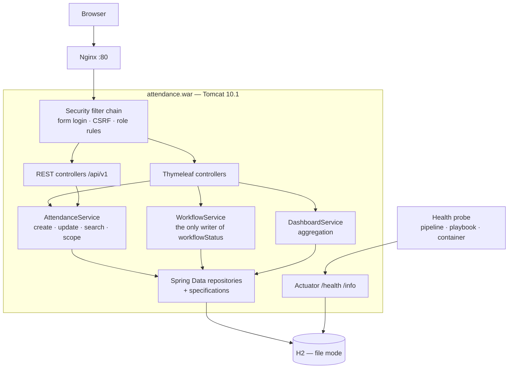
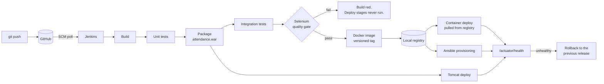

# Stage 15 — Final End-to-End Release, Documentation and Viva

**Deliverable:** final repository, live demonstration, complete report,
screenshots, presentation and viva pack.
**Issue:** [#11](https://github.com/Swaroop192005/CI-CD-Pipeline-for-a-Student-Attendance-Management/issues/11)

---

## 1. The end-to-end run

One commit, through every stage, with no manual step.

**Commit** `34dc877` — *docs(readme): record that the fifteen project tasks are complete*
**Version** `1.0.17-34dc877`

| # | Phase | Tool | Result |
|---|---|---|---|
| 1 | Commit and push | Git / GitHub | `34dc877` on `develop` |
| 2 | Build | Jenkins + Maven | 5.2 s |
| 3 | Unit tests | Surefire | 73 passed, 24.3 s |
| 4 | Package | Maven | `attendance.war`, 6.4 s |
| 5 | Integration tests | Failsafe | 7 passed, 13.1 s |
| 6 | **Quality gate** | Selenium, 5 journeys | 20 passed, 79.5 s |
| 7 | Image | Docker | `1.0.17-34dc877`, 11.1 s |
| 8 | Registry | `registry:2` | Published and read back |
| 9 | Container deploy | Docker, pulled from registry | Healthy, 10.3 s |
| 10 | Tomcat deploy | Tomcat 10.1 | Healthy, 6.1 s |
| 11 | Verify | Health + parameter assertion | 19.3 s |
| 12 | Provision | Ansible | `changed=5`, `failed=0` |
| | **TOTAL (pipeline)** | | **178.3 s** |

**100 tests** published in one report: 73 unit and slice, 7 integration,
20 browser journeys.

### Three deployment targets, one artefact, all healthy

```
Tomcat       :8091  {"status":"UP"}   environment: production
Container    :8101  {"status":"UP"}   environment: production
Ansible node :80    {"status":"UP"}   environment: production, release 1.0.17-34dc877
```

Full transcript: [`proofs/stage-15/end-to-end-run.log`](../proofs/stage-15/end-to-end-run.log).

---

## 2. Architecture

### 2.1 Application



Four rules hold the design together:

1. A controller never touches a repository.
2. `workflowStatus` is written only by `WorkflowService` (BR-07) — which
   is what makes the audit trail complete rather than mostly complete.
3. Authorisation is enforced in the filter chain **and** re-checked in the
   service, because a URL pattern cannot express "the author of *this*
   record".
4. Record scoping lives in the service, so the list and the detail view
   are restricted by the same rule rather than by two that can drift.

### 2.2 Delivery pipeline



The gate's position is the whole point: after the artefact exists, before
anything is deployed.

### 2.3 Release and rollback model

```
/opt/attendance/releases/1.0.0
/opt/attendance/releases/1.0.1
/opt/attendance/releases/1.0.17-34dc877
/opt/attendance/current -> /opt/attendance/releases/1.0.17-34dc877
```

The symlink *is* the deployment. Rollback reverses that one step, which is
why it does not depend on the registry, the network or the originating
build still existing — the things most likely to be broken when a rollback
is needed.

---

## 3. Results against the Stage 1 success criteria

| ID | Criterion | Target | Achieved | Evidence |
|---|---|---|---|---|
| SC1 | Time to record one session | < 2 min | **1–2 s** | J1 asserts it; `proofs/stage-09` |
| SC2 | Delay before a student sees an approved mark | Same session | **Immediate** | J4; baseline was 9–14 days |
| SC3 | Re-keying steps | 0 | **0** | Single write path |
| SC4 | State changes carrying actor + timestamp | 100% | **100%** | `WorkflowServiceTest` (16 tests) |
| SC5 | Unauthorised attempts refused | 100% | **100%** | J5 checks by URL, not just UI |
| SC6 | Test pass rate on `develop` | 100% | **100%** (100 tests) | Build #17 |
| SC7 | Coverage of domain + service | ≥ 70% | JaCoCo wired into the build | `app/pom.xml` |
| SC8 | Critical journeys covered | 5 of 5 | **5 of 5** | 20 Selenium tests |
| SC9 | Failing test stops deployment | Always | **Proven** | Stage 10, build #10 |
| SC10 | Commit → running container | Automated | **178 s, no manual step** | Build #17 |
| SC11 | Re-running provisioning changes nothing | `changed=0` | **`changed=0`** | Stage 14 |
| SC12 | Rollback to previous release | < 2 min | **3 tasks, under a minute** | Stage 14 |
| SC13 | Post-deployment health check | Automated | **Three-part check** | `healthcheck.yml` |

All thirteen met.

---

## 4. Troubleshooting guide

Every problem below was actually hit during this project. Each is recorded
with the symptom first, because the symptom is what the next person will
have.

### 4.1 Environment and network

| Symptom | Cause | Fix |
|---|---|---|
| `docker info` → `dial unix /var/run/docker.sock: no such file` | CLI installed, daemon not started | `nohup dockerd &`, wait 10 s |
| `curl https://get.jenkins.io` → `CONNECT tunnel failed, 403` | Host refused by the egress policy | Install Jenkins from its official image instead |
| `apt-get update` → `403 Forbidden` on `deb.debian.org` | apt speaks plain HTTP; the proxy serves only HTTPS | Rewrite the sources to `https://` and set `Acquire::https::Proxy` |
| Maven → `PKIX path building failed` | **The JVM does not read `HTTPS_PROXY`** | Pass `-Dhttps.proxyHost`/`-Dhttps.proxyPort` **and** a truststore holding the proxy CA. Both are needed |
| Truststore import "succeeds" but PKIX persists | `keytool -importcert` reads **only the first certificate** in a PEM file | Split the chain and import each certificate |
| apt on a fresh node → certificate not trusted, even with the CA appended | GnuTLS validates against the system store as a whole | Bootstrap with a *complete* bundle, then `update-ca-certificates` |
| Ansible → "Failed to update apt cache" with an empty error | The node cannot reach the proxy: its `127.0.0.1` is itself | Relay the loopback proxy to the bridge gateway (`ansible/lab/proxy-relay.py`) |
| `No package matching 'unzip' is available` | Empty apt cache, skipped by `cache_valid_time` | Refresh the cache explicitly in `pre_tasks` |
| `puppet module install` → `Unable to verify the SSL certificate` | Puppet's bundled Ruby ignores `SSL_CERT_FILE` **and** `--ssl_trust_store`, so the Forge is unreachable whatever the trust store holds | Carry no Forge dependencies; reimplement the two `stdlib` features needed (`Stdlib_absolutepath`, `assert_private()`) inside the module |
| `attendance::assert_private` → both module names empty | The modern Puppet function API exposes the scope the function was *defined* in, not the caller's; stdlib uses the Ruby 3.x API where `self` **is** the caller | Pass `$name` and `$caller_module_name` in explicitly — both are in scope in any class body |
| Puppet `onlyif` guard never fires, so `E: Unable to locate package` on a bare node | Puppet runs `onlyif` **without a shell**, so `$(...)` and `$((...))` go to `test` as literal arguments; the guard also watched `pkgcache.bin`, apt's binary cache, which any apt call regenerates | Wrap the guard in `/bin/sh -c`, and test `/var/lib/apt/lists` — measuring staleness from the **directory** mtime, since apt preserves the server's `Last-Modified` on the index files themselves |

### 4.2 Build and application

| Symptom | Cause | Fix |
|---|---|---|
| H2 → `Feature not supported: "AUTO_SERVER=TRUE && DB_CLOSE_ON_EXIT=FALSE"` | H2 2.3 refuses that combination | Drop `AUTO_SERVER`; nothing needs multi-process access |
| Every page 500s with `EL1025E: The collection has '0' elements` | A principal can have no authorities; an indexed expression in the shared layout then fails on **every** page | Resolve the role in a `ControllerAdvice` with an empty fallback |
| Login through nginx redirects to port 80 → `ERR_CONNECTION_REFUSED` | `proxy_set_header Host $host` — nginx's `$host` strips the port, and Spring Security builds its redirect `Location` from the Host header. **Every curl health check still passed**, because the health endpoint never redirects | `proxy_set_header Host $http_host`, which is the client's Host header verbatim. Fixed in both the Ansible and the Puppet template |
| Tests fail with a unique-constraint violation in `@BeforeEach` | Hibernate orders queued inserts **ahead of** queued deletes in one transaction | `deleteAllInBatch()`, which issues the DELETE immediately |
| `*IT` tests compile but never run | Failsafe needs explicit executions | Declare `integration-test` and `verify` goals |
| Sign-in fails only on a fresh start | Seeding ran as an `ApplicationRunner`, which fires **after** the port is bound, so health reported `UP` before the accounts existed | Seed during context refresh, via a `TransactionTemplate` |

### 4.3 Pipeline and containers

| Symptom | Cause | Fix |
|---|---|---|
| Jenkins boot-loops, `UnknownAttributesException` | Invalid CasC key | `loggedInUsersCanDoAnything`; drop the crumb-issuer block |
| Gate container starts with no artefact | A `-v` path is resolved against the **host** filesystem, not the controller's workspace; Docker silently creates an empty directory | `docker create` → `docker cp` → `docker start` |
| `COPY` brings in nothing and the layer stays cached | `.dockerignore` re-include needs `!dir`, not `!dir/` | Re-include the directory itself |
| A refused POST answers **405**, not 403 | The filter chain forwards the original request to a GET-only error page | Map the page for every method and set 403 explicitly |
| `docker stop` always takes 10 s | The JVM is not PID 1, so SIGTERM reaches a shell that does not forward it | `exec` form entrypoint |

### 4.4 Browser tests

| Symptom | Cause | Fix |
|---|---|---|
| ChromeDriver refuses to start a session | Driver major version ≠ browser major version | Pin both; the suite installs a matching driver |
| Failure screenshots never appear | `TestWatcher` fires **after** `@AfterEach`, by which time the driver is quit | `AfterTestExecutionCallback`, which runs before it |
| A logout test passes without testing logout | `GET /logout` does nothing — it is a CSRF-protected POST — and the next sign-in replaces the session anyway | Click the sign-out button |

---

## 5. Limitations

Stated plainly. Each is a real constraint of this delivery, not a
criticism of the design it was traded against.

### 5.1 Application

| # | Limitation | Consequence | Why it was accepted |
|---|---|---|---|
| A1 | H2 file database, single node | No replication; the datastore is a single point of failure | A separate RDBMS is one more service to install, secure and provision on a 4 vCPU machine. Swapping it is a `SPRING_DATASOURCE_URL` change |
| A2 | No bulk import | A term's historical data must be entered record by record | Explicitly out of the frozen MVP scope |
| A3 | Audit trail is on the record, not a separate ledger | A database administrator could alter history without trace | Accepted in Stage 1 §6.3 as proportionate for a departmental system |
| A4 | Server-rendered pages, full reload per action | Slower than a single-page application on a poor connection | Removes a whole JavaScript build chain; constraint C12 |
| A5 | Sessions are in memory | A restart signs everyone out | Acceptable for a single instance; a shared session store is needed before scaling out |
| A6 | No pagination on the dashboard aggregates | The dashboard loads all visible records to aggregate; at tens of thousands this becomes slow | Within NFR-01 at the modelled volume; a database-side aggregate is the fix |
| A7 | **Every session needs HOD approval before it counts** | At departmental scale the review queue becomes the bottleneck the system was meant to remove. Real practice is that a faculty mark is immediately official, with sign-off attaching to post-lock corrections or to the consolidated pre-examination statement | A deliberate simplification, not observed practice. The workflow is what gives three roles genuine, differing authority over one record, which is what the Stage 9 journeys exercise. Recorded as an assumption in Stage 1 §6.3; F15 is the realistic design |

### 5.2 Infrastructure

| # | Limitation | Consequence |
|---|---|---|
| I1 | Registry is unauthenticated plain HTTP | Only acceptable because it is bound to loopback on one node. A real deployment needs TLS and authentication |
| I2 | Jenkins has one executor set and no agents | Builds serialise |
| I3 | The target node is a container | Nothing in the playbook depends on it — it manages packages, users, files, ports and systemd units — but a VM would exercise the boot path too |
| I4 | Secrets are environment variables with development defaults | A real deployment needs a secret store; Jenkins credentials or Ansible Vault |
| I5 | No TLS anywhere | Everything is HTTP on a lab network |
| I6 | The annotated tags `v1.0.0` and `v1.2.0` exist locally but are not on `origin` | Not a repository problem, and not fixable from here: four routes were tried and all are refused by session policy — `git push` (HTTP 403), the Git refs API (*"Write access to this GitHub API path is not permitted through this proxy"*), the Releases API (*"Creating, editing, or deleting releases is not permitted for this session type"*), and the GitHub MCP server, whose tag and release operations are all read-only. Branch pushes from the same credentials succeed throughout, so the restriction is specific to `refs/tags/*`. Evidence in `proofs/stage-06/tag-push-attempts.log`; the tag objects with their release notes in `proofs/stage-06/release-tag.log`. The tag objects live only in the build container, so a fresh clone has none to push; `scripts/publish-release-tags.sh` rebuilds both from the recorded commits and annotations and pushes them, and has been verified against a fresh clone |

### 5.3 Process

| # | Limitation |
|---|---|
| P1 | Single developer. The branch-and-review discipline is genuinely enforced, but GitHub will not let an author formally request changes on their own pull request, so reviews are recorded as comment reviews |
| P2 | SCM polling every two minutes rather than a webhook, because the lab controller is not reachable from GitHub |
| P3 | No load or soak testing. NFR-01 is argued from design and a modelled volume, not measured under sustained load |

---

## 6. Future enhancements

Ordered by value for effort, not by how interesting they are.

### Near term

| # | Enhancement | Why first |
|---|---|---|
| F1 | PostgreSQL with scheduled backups | Removes limitation A1 — the single most consequential gap for a system of record. The application needs only a datasource change |
| F2 | TLS end to end, with certificates in the playbook | Removes I5. Attendance data is personal data |
| F3 | Secrets in Jenkins credentials and Ansible Vault | Removes I4 |
| F4 | Bulk import from a spreadsheet (US-21) | The largest remaining manual effort for an administrator |
| F5 | GitHub webhook instead of polling | Removes a two-minute delay and the wasted polls |

### Medium term

| # | Enhancement | Why |
|---|---|---|
| F6 | Shortage notification by SMS or e-mail (US-22) | The dashboard surfaces at-risk students; this closes the loop by telling them |
| F7 | Parent/guardian read-only portal | Deferred stakeholder from Stage 1 §3.3 |
| F8 | Immutable audit log in a separate append-only store | Removes A3 and would satisfy a stricter audit |
| F9 | Blue-green deployment | Removes the restart gap that currently exists during a deploy |
| F10 | Database-side dashboard aggregation | Removes A6 before the data volume reaches it |
| F15 | Immediate marking, with review only on post-lock corrections | Removes A7, the project's least realistic design decision. Faculty marks become official on save; the register locks after a configurable window; only corrections after that point enter the HOD queue. BR-04 is unaffected — approval still gates what counts |

### Longer term

| # | Enhancement | Why |
|---|---|---|
| F11 | Biometric or RFID capture (US-23) | Removes manual entry entirely, but needs hardware and a privacy assessment |
| F12 | University ERP integration | Removes double entry of the student roll |
| F13 | Kubernetes (US-24) | Only once there is more than one node to orchestrate |
| F14 | Multi-institution tenancy | Only if the portal is adopted beyond one college |

---

## 7. Presentation outline

| # | Slide | Content |
|---|---|---|
| 1 | Title | Project, name, course |
| 2 | The problem | 9–14 day delay, 4.1% error rate, no audit trail, 23 of 61 notices too late |
| 3 | Stakeholders and scope | Eight stakeholders; the frozen 15-task MVP |
| 4 | Agile plan | 24 backlog items, three sprints, the Definition of Done |
| 5 | Architecture | Layered application; the four rules |
| 6 | Workflow state machine | `DRAFT → SUBMITTED → APPROVED/REJECTED`, with attribution |
| 7 | Repository and branching | `main`/`develop`/`feature/*`, 7 pull requests, the resolved conflict |
| 8 | **Live demo 1** | Faculty records → HOD approves → student sees it, same session |
| 9 | Jenkins | Controller as code; the CI job |
| 10 | Pipeline as code | Eleven stages; the parameterised environment, verified not assumed |
| 11 | Selenium | Five journeys; J1 asserts the two-minute objective |
| 12 | **Live demo 2** | The quality gate failing and blocking a deployment |
| 13 | Docker | Image, non-root, healthcheck, lifecycle, volume persistence |
| 14 | Registry and CD | Versioned tags; why `latest` alone cannot be rolled back to |
| 15 | Ansible | Configuration specification; four roles |
| 16 | **Live demo 3** | `changed=0`, then a corrupt release rolled back |
| 17 | Results | All thirteen success criteria met |
| 18 | What went wrong | The fail-open bug, the silent screenshot mechanism, the bind-mount that produced an empty container |
| 19 | Limitations and future work | Honest list, ordered by value |
| 20 | Questions | |

---

## 8. Viva question bank

Prepared answers, with the reasoning rather than the definition.

### Application design

**Q. Attendance doesn't really work like this, does it? Why does a Head of
Department approve every single class session?**
It doesn't, and this is the weakest design decision in the project. In
practice a faculty mark is official the moment it is saved; sign-off
attaches to corrections made after the register locks, or to the
consolidated statement issued before examinations. A per-session queue
would not survive a 600-student department — the review queue becomes
exactly the bottleneck the system was built to remove.

I chose it because the project's subject is the delivery pipeline, and I
wanted a domain with real role separation: three roles with genuinely
different authority over the same record, so the Stage 9 browser journeys
have something meaningful to assert across roles. It is recorded as
assumption 5 in Stage 1 §6.3 and as limitation A7.

The realistic design is F15: marking is immediate, the register locks
after a configurable window, and only post-lock corrections enter the
queue. One rule survives either way, and it is the one worth defending —
BR-04, that only approved records count toward a percentage. Whatever
triggers the review, a mistaken or half-entered record should never
become a fact that decides a student's examination eligibility.

**Q. Why is `WorkflowService` the only component allowed to change `workflowStatus`?**
Because the audit trail has to be complete, not mostly complete. One code
path between states means there is exactly one place that can move a
record, and it cannot be taken without recording who took it and when. If
two components could write that field, the second one would eventually
forget.

**Q. Why does `EXCUSED` leave both sides of the percentage?**
Counting approved leave as an absence punishes a student for a certificate
the institution itself accepted. Excluding it from the numerator only
would be worse — it would silently lower their percentage.

**Q. You enforce the uniqueness rule twice. Isn't that duplication?**
Deliberate. The service check produces a message the user can act on
("a record already exists for 1CS21CS001 in CS501 on…"). The database
constraint is what actually holds under two concurrent submissions. Each
does something the other cannot.

**Q. A bug was found in review. What was it?**
`CurrentUser.restrictedToRollNumber()` returned `Optional.empty()` for two
incompatible cases: "this role is not scoped" and "this student has no
roll number". `Optional.map` over null yields empty, so a misconfigured
student account fell into the unscoped branch — the account that most
needed restricting was the one that got unrestricted access. It now throws.

### Testing

**Q. Why five journeys rather than one test per page?**
A page is not a thing a user wants; a journey is. Each one traces a Stage 1
pain point to the thing that would have to work for the pain to go away.

**Q. Why does J5 request forbidden URLs directly instead of checking the button is hidden?**
Hiding a control is a convenience. A test that only checked the button
would pass against a system whose server accepted the request anyway —
which is the vulnerability, not the missing button.

**Q. How do you know the failure-screenshot mechanism works?**
Because a test was deliberately made to fail and the artefacts were kept.
The first implementation produced nothing at all — it was a `TestWatcher`,
which fires after `@AfterEach`, by which time the driver is quit. A capture
mechanism that has never captured anything is not evidence.

### CI/CD

**Q. Where is the quality gate, and why there?**
Between integration test and deploy. After the artefact exists so there is
something to test, and before anything is deployed so there is nothing to
regret.

**Q. How do you know the gate actually blocks a deployment?**
A real regression was introduced — pagination links that dropped the active
filters. Build #10 went red at the gate, and the console shows zero
`Deploying…` lines, zero `docker run` calls and zero `Parameter verified`
lines. Build #11, after the fix, deployed normally.

**Q. Why does the image package the WAR rather than rebuild it?**
So that the binary that ships is the binary the tests ran against. "It was
the same source" is a weaker claim than "it was the same artefact".

**Q. Why push a version tag when `latest` is simpler?**
Because a tag that moves cannot be rolled back to, and rollback is
precisely "run the previous version again".

**Q. The pipeline verifies the environment parameter. Why not trust it?**
A deployment that is healthy but configured for the wrong environment is
the failure that otherwise goes unnoticed until someone finds production
data in a staging datastore.

### Configuration management

**Q. Why Ansible rather than Puppet?**
Both, in the end. The stage asked for either. Ansible was primary because
it is agentless — a single node needs no master or agent existing to
justify itself — and because `apt.puppet.com` is refused by the lab's
egress policy, which blocked the first Puppet attempt. That turned out to
be a statement about one installation route rather than about Puppet:
7.20.0 was installed by extracting the official Docker image, and
`puppet/` now implements the same specification, applied masterless.

**Q. What did building it a second time actually buy you?**
Two things. It proves the Stage 13 specification is tool-neutral rather
than a transcript of whatever the playbook happened to do — the two tools
converge all four managed files to byte-identical content once each one's
"managed by" banner is stripped. And provisioning the node a second way
meant exercising it a second way, which is what found the reverse-proxy
defect: both templates set `proxy_set_header Host $host`, which drops the
port, so every Spring Security redirect pointed at port 80. Every curl
health check in Stages 13 and 14 passed regardless, because the health
endpoint never redirects. A browser on a non-default port found it in
seconds.

**Q. Puppet's drift correction — what does it show that Ansible doesn't?**
Ansible proves idempotency: run it twice, the second run reports
`changed=0`. Puppet proves convergence, which is a stronger claim about a
*divergent* node. Four changes were made by hand on a converged node — a
config file deleted, another overwritten with garbage, the service
stopped, a directory chowned to root — and the manifest re-applied. It
repaired those four and only those four, re-validated the nginx config,
and reloaded it through the notify chain. That is the model difference
between pushing tasks and compiling a catalogue to compare against live
state.

**Q. Why does `changed=0` matter so much?**
A playbook that reports changes every run gives an operator no way to tell
real drift from noise. They stop reading the recap — and then miss the run
that mattered.

**Q. Why is rollback a symlink rather than re-fetching the artefact?**
Because re-fetching depends on the registry, the network and the
originating build still existing, and those are exactly the things that may
be broken at the moment a rollback is needed.

**Q. Your rollback failed once. What happened?**
A wrong template path. It failed **before** touching the symlink, so the
node was left exactly as it was. A half-applied rollback is worse than
none — the operator then has to work out which half.

### Process

**Q. You created the merge conflict deliberately. Why?**
Because resolving one is a skill, and sequencing work to avoid conflicts
is how teams end up unable to resolve them. Both sides were kept: one added
traceability, the other added substance, and `--theirs` would have silently
deleted half the information.

**Q. What would you do differently?**
Set up the proxy and trust configuration once, at the start, as shared
build infrastructure. The same PKIX failure was diagnosed four times — in
the Jenkins image, in the Maven build, in the application image and on the
Ansible node — because each was treated as a new problem rather than one
problem with four faces.

---

## 9. Evidence index

| Stage | Document | Evidence |
|---|---|---|
| 0 | [Environment prerequisites](00-environment-prerequisites.md) | `proofs/stage-00/` |
| 1 | [Problem definition](stage-01-problem-definition.md) | — |
| 2 | [Agile planning](stage-02-agile-planning.md) | — |
| 3 | [Requirements and architecture](stage-03-requirements-architecture.md) | `proofs/stage-03/` |
| 4 | [Repository initialisation](stage-04-repository-initialisation.md) | `proofs/stage-04/` |
| 5 | [Feature branching](stage-05-feature-branching.md) | `proofs/stage-05/` |
| 6 | [MVP and collaboration](stage-06-mvp-collaboration.md) | `proofs/stage-06/` |
| 7 | [Jenkins CI](stage-07-jenkins-ci.md) | `proofs/stage-07/` |
| 8 | [Pipeline as code](stage-08-pipeline-as-code.md) | `proofs/stage-08/` |
| 9 | [Selenium tests](stage-09-selenium-tests.md) | `proofs/stage-09/` |
| 10 | [Continuous testing](stage-10-continuous-testing.md) | `proofs/stage-10/` |
| 11 | [Docker lifecycle](stage-11-docker-lifecycle.md) | `proofs/stage-11/` |
| 12 | [Jenkins–Docker CD](stage-12-jenkins-docker-cd.md) | `proofs/stage-12/` |
| 13 | [Configuration management](stage-13-configuration-management.md) | `proofs/stage-13/` |
| 14 | [Provisioning and reliability](stage-14-provisioning-reliability.md) | `proofs/stage-14/` |
| 15 | This document | `proofs/stage-15/` |

All fifteen reports are also combined into a single submission document:
[`docs/FINAL-REPORT.md`](FINAL-REPORT.md).

### Pull requests

| PR | Title | Stage |
|---|---|---|
| #12 | Record and view attendance (feature 1) | 5 |
| #13 | Requirement traceability in the README | 6 |
| #14 | Complete the MVP — update, search, workflow, dashboard | 6 |
| #15 | Jenkins controller, CI job and declarative pipeline | 7, 8 |
| #16 | Selenium journeys and the deploy-blocking quality gate | 9, 10 |
| #17 | Containerise the portal and deploy it from a registry | 11, 12 |
| #18 | Provision, health check and roll back with Ansible | 13, 14 |

---

## 10. Stage 15 Definition of Done

| # | Criterion | Status |
|---|---|---|
| D3 | Everything green | 100 tests, pipeline green, playbooks green |
| D5 | Jenkins pipeline green | Build #17 |
| D6 | Selenium quality gate passed | 20 journeys |
| D8 | Documentation complete | 16 documents + the combined report |
| D9 | Evidence captured | `proofs/stage-00` … `proofs/stage-15` |
| D10 | Deployed instances answer their health checks | Three targets, all `UP` |
| D12 | Backlog updated | All 20 committed stories Done |

**Outcome:** the complete DevOps workflow runs from one commit to a
health-checked deployment on three targets in under three minutes with no
manual step, all thirteen measurable success criteria from Stage 1 are
met, and the documentation records not only what was built but what went
wrong and what was learned from it.
